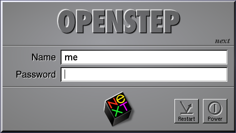
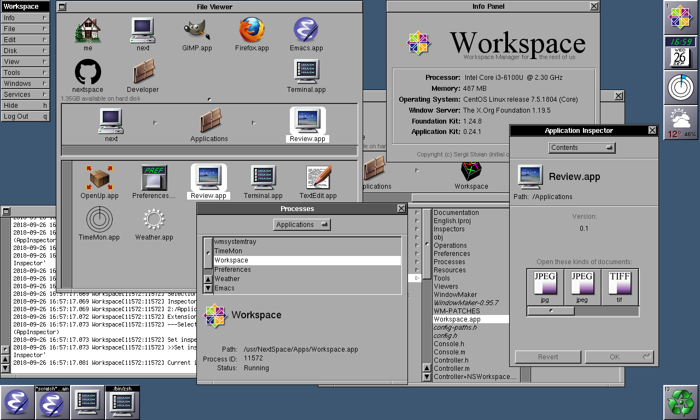

# NEXTSPACE

NEXTSPACE is desktop environment that brings [NeXTSTEP](https://en.wikipedia.org/wiki/NeXTSTEP) look and feel to Linux. I try to keep the user experience as close as possible to the original NeXT's OS. It is developed according to ["OpenStep User Interface Guidelines"](http://www.gnustep.org/resources/documentation/OpenStepUserInterfaceGuidelines.pdf).
> If you've noticed or ever bothered with naming convention all of these "NeXTSTEP, NextStep", here is [explanation](Documentation/OpenStep%20Confusion.md).

## What is it?
I want to create fast, elegant, reliable and easy to use desktop environment with maximum attention to user experience and visual pleasure. In the future I would like to see it as a platform where applications will be running with a taste of NeXT's OS. Core applications: Login, Workspace and Preferences - are base for future applications development and example of style and application integration.

NEXTSPACE is not just applications loosely integrated to each other. Also it's a core OS, frameworks, mouse cursors, fonts, colors, animations and everything I think will help user to be effective and happy.

## Why am I doing this?
1. I like look, feel and design principles of NeXTSTEP.
2. I think [GNUstep](http://www.gnustep.org) needs reference implementation of user oriented desktop environment.
3. As main developer of [ProjectCenter](http://www.gnustep.org/experience/ProjectCenter.html) (IDE for GNUstep) I need desktop environment where ProjectCenter can be developed, tested and integrated with.
4. I beleive it will become interesting environment for developers and comfortable (fast, easy to use, feature-rich) for users.

Unlike other 'real' and 'serious' projects I've not defined target audience for NEXTSPACE. I intentionally left aside modern UI design trends (fancy animations, shadows, gray blurry lines, flat controls, acid colours, transparency). I like this accurate, clear, grayish, boring UI that just helps, not hinder, to get my job done...

## I will not plan to do
* Porting to other Linux distributions and operating systems for now. I want fast, accurate and stable version for CentOS 7 at last. However, NEXTSPACE was designed to be portable and this point maybe changed in future.
* WindowMaker only fork (Workspace includes WindowMaker though).
* GNOME, KDE, MacOS rival in terms of visual effects, modern design principles, look and feel.
* Implement MacOS X like desktop paradigm. There is another good place for this -- [Étoilé](http://etoileos.com).

# Applications
Below is a brief description of core applications.
## Login
Simple login panel where you enter your user name and password.

## Workspace
Fast and elegant Workspace Manager - uses multithreading to provide maximum smoothness for:
* File system navigation, file management (create, copy, move, link files/directories).
* Seamless applications, processes and window management (start, close, resize, move, maximize, miniaturize).
* MacOS-style window resizing: cursor stops moving when maximum/minimum size of the window was reached, mouse cursor changes it image to give a hint for available directions.
* Virtual desktops, Dock, applications and window icons.
* Media management - automatically mounts removable media, provide menu items to eject/mount/unmount removables.
* Background processes - all file and media management operations has status representation with control (stop, pause, cancel).
* Launcher - panel to run commands with autocompletion and history.
* Recycler - drag and drop support, ability to restore recycled objects to original location with single button click.
* Other: inspectors for various types of contents, finder, console messages and preferences for various parts of Workspace.

## Preferences
Settings for locale, fonts, displays (size, arrangement), keyboard, mouse, sound, network, power management.

 

## Terminal
Terminal with Linux console emulation. I've started with version created by Alexander Malmberg and make numerous fixes and enhancements. Original application can found at [GNUstep Application Project](http://www.nongnu.org/gap/terminal/index.html) site. Enhancements to the original application are numerous. Some of them:
* Preferences and Services panels are rewritten from scratch.
* Numerous fixes and enhancements in: color management (background, foreground can be any and can be configured in preferences, bold, blink, inverse, cursor colours), cursor placement fixes on scrolling and window resizing, 'Clear Buffer' and 'Set Title' menu items.
* Search through the text displayed in Terminal window (Find panel).
* Session management: you can save window with all settings that are set in preferences panel (including shell/command) to a file and then open it. Configuration with multiple windows is supported.

# Frameworks
* NXAppKit: GUI classes that can be useful in multiple applications (for example: ClockView, ProgressBar and ProgressPie).
* NXSystem: system-specific classes go here (UDisks, UPower, D-BUS, XRandR, XKB, etc.).
* NXFoundation: non-graphical utility classes (custom defaults and bundle management, etc.)
>'NX' prefix is a tribute to the NeXTstep classes back in early 90th but has no connection to original NeXT's API.

# Core technologies it is based on
* [CentOS Linux 7](https://www.centos.org) and its technologies (systemd, UDisks2, Xorg, etc.): stable, well supported enterprise level OS.
* Compiler: [Clang](http://www.llvm.org/) 3.8.1
* Objective-C runtime: [libobjc2](https://github.com/gnustep/libobjc2) by David Chisnall.
* Multithreading: [libdispatch](https://github.com/apple/swift-corelibs-libdispatch) by Apple.
* [OpenStep](https://en.wikipedia.org/wiki/OpenStep) implementation: [GNUstep](http://www.gnustep.org). This is where I started from back in 2001. Additional functionality and fixes will go upstream when it will be ready.
* [WindowMaker](https://windowmaker.org/): great window manager. It is still alive and in active development. All changes I'm packaging as a set of patches (to the original 0.95.7 version) which can be pushed to upstream project later.

# Status of implementation
* [Login](https://github.com/trunkmaster/nextspace/projects/6)
* [Workspace](https://github.com/trunkmaster/nextspace/projects/4)
* [Preferences](https://github.com/trunkmaster/nextspace/projects/2)
* [Terminal](https://github.com/trunkmaster/nextspace/projects/3)

