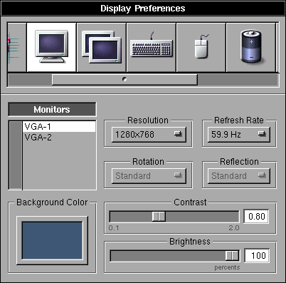
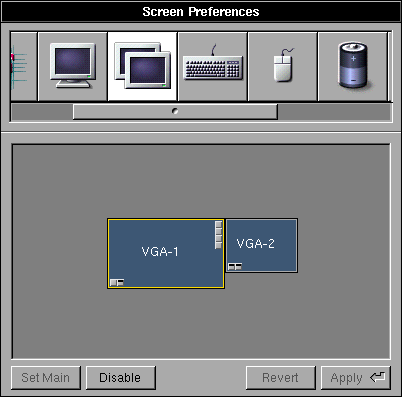
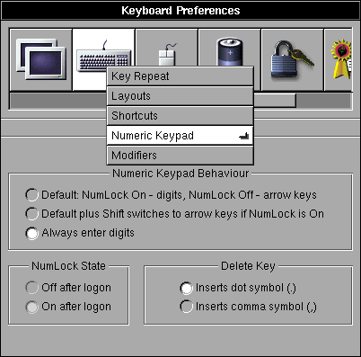

# NEXTSPACE

NEXTSPACE is desktop environment that brings [NeXTSTEP](https://en.wikipedia.org/wiki/NeXTSTEP) look and feel to Linux. I try to keep the user experience as close as possible to the original NeXT's OS. It is developed according to ["OpenStep User Interface Guidelines"](http://www.gnustep.org/resources/documentation/OpenStepUserInterfaceGuidelines.pdf).
> If you've noticed or ever bothered with naming convention all of these "NeXTSTEP, NextStep", here is [explanation](Documentation/OpenStep%20Confusion.md).

I want to create fast, elegant, reliable and easy to use desktop environment with maximum attention to user experience (usability) and visual maturity. In the future I would like to see it as a platform where applications will be running with a taste of NeXT's OS. Core applications: Login, Workspace and Preferences - are the base for future applications development and example of style and application integration methods.

NEXTSPACE is not just applications loosely integrated to each other. Also it's a core OS, frameworks, mouse cursors, fonts, colors, animations and everything I think will help user to be effective and happy.

## Why am I doing this?
1. I like look, feel and design principles of NeXTSTEP.
2. I think [GNUstep](http://www.gnustep.org) needs reference implementation of user oriented desktop environment.
3. I beleive it will become interesting environment for developers and comfortable (fast, easy to use, feature-rich) for users.

Unlike other 'real' and 'serious' projects I've not defined target audience for NEXTSPACE. I intentionally left aside modern UI design trends (fancy animations, shadows, gray blurry lines, flat controls, acid colors, transparency). I like this accurate, clear, grayish, "boring" UI that just helps, not hinder, to get my job done...

## I will not plan to do
* Porting to other Linux distributions and operating systems for now. I want fast, accurate and stable version for CentOS 7 at last. However, NEXTSPACE was designed to be portable and this point maybe changed in future.
* GNOME, KDE, MacOS rival in terms of visual effects, modern design principles, look and feel.
* Implement MacOS X like desktop paradigm. There is another good place for this -- [Étoilé](http://etoileos.com).

# Applications
Below is a brief description of core applications. More information about applications functionality will be added on . Stay tuned!

## Login
[Status of implementation](https://github.com/trunkmaster/nextspace/projects/6)

Simple login panel where you enter your user name and password. No screenshot - it's exact copy of NeXTSTEP `loginwindow` in terms of look and feel.

## Workspace
[Status of implementation](https://github.com/trunkmaster/nextspace/projects/4)

Fast and elegant Workspace Manager - uses multithreading to provide maximum smoothness for:
* File system navigation, file management (create, copy, move, link files/directories).
* Seamless application, process and window management (start, autostart, close, resize, move, maximize, miniaturize, hide).
* MacOS-style window resizing: cursor stops moving when maximum/minimum size of the window was reached, mouse cursor changes it's image to give a hint for available directions.
* Virtual desktops, Dock, applications and window icons.
* Media management - automatically mounts removable media, provide menu items to eject/mount/unmount removables.
* Background processes - all file and media management operations has status representation with control (stop, pause, cancel).
* Launcher - panel to run commands with autocompletion and history.
* Recycler - drag and drop support, ability to restore recycled objects to original location with single button click.
* Other: inspectors for various types of contents, finder, console messages and preferences for various parts of Workspace.
> Note: Workspace is not:
> * WindowMaker with some patches
> * WindowMaker with some good configuration defaults only
> * Another WindowMaker implementation.

> It's written from scratch. Some WindowMaker code is a part of Workspace (as well as configuration defaults) to provide window management functions. It's loosely coupled with Workspace to provide seamless intergation. Configurable parameters of integrated WindowMaker spread across Workspace's Preferences and Preferences application.

> Workspace theoretically can be used without WindowMaker. But current development focused on **single** application to deliver best user experience as a result.

## Preferences
[Status of implementation](https://github.com/trunkmaster/nextspace/projects/2)

Settings for locale, fonts, displays (size, brightness, contrast (gamma correction), desktop background, displays arrangement), keyboard (repeat, layouts, numpad behaviour, modifiers), mouse (delay, treshold, scrollwheel settings, mouse buttons configutation), sound, network, power management.

  
 

## Terminal
[Status of implementation](https://github.com/trunkmaster/nextspace/projects/3)

Terminal with Linux console emulation. I've started with version created by Alexander Malmberg and make numerous fixes and enhancements. Original application can found at [GNUstep Application Project](http://www.nongnu.org/gap/terminal/index.html) site. Enhancements to the original application are numerous. Some of them:
* Preferences and Services panels are rewritten from scratch.
* Numerous fixes and enhancements in: color management (background, foreground can be any and can be configured in preferences, bold, blink, inverse, cursor colours), cursor placement fixes on scrolling and window resizing, 'Clear Buffer' and 'Set Title' menu items.
* Search through the text displayed in Terminal window (Find panel).
* Session management: you can save window with all settings that are set in preferences panel (including shell/command) to a file and then open it. Configuration with multiple windows is supported.

# For developers
For those who eager to know "How it's done?" look for information on development tasks, goals, solutions, implementation details, build instructions at 
